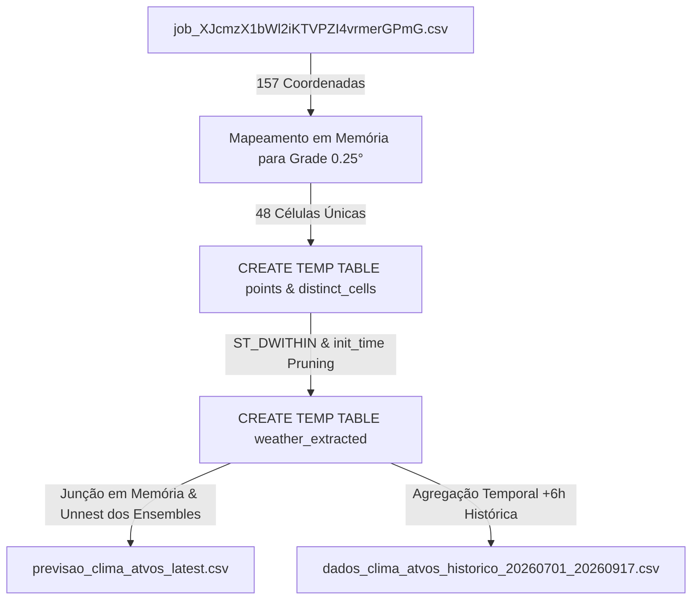

# 🌦️ Previsão de Clima - WeatherNext 2 & Atvos

Pipeline em Python e BigQuery para extração, processamento geoespacial e geração de previsões meteorológicas probabilísticas de alta resolução (Google DeepMind WeatherNext 2) para pontos de interesse geográficos (coordenadas operacionais da Atvos).

---

## 📌 Visão Geral

Este projeto realiza a ingestão de coordenadas geográficas (como unidades, polos agrícolas e talhões) e extrai previsões meteorológicas numéricas completas diretamente do **WeatherNext 2**, modelo meteorológico global de inteligência artificial de alta precisão disponibilizado via **Google Cloud BigQuery**.

A solução processa dados probabilísticos (**64 membros de ensemble**) ao longo de um horizonte de **15 dias (360 horas)** com intervalos de 6 horas, aplicando conversões automáticas para unidades operacionais práticas (°C, mm, m/s).

Adicionalmente, inclui scripts dedicados para extração de séries temporais históricas consolidadas (análise/reanálise operacional) e documentação técnica detalhada sobre a teoria de ensembles e métricas estatísticas aplicadas ao agronegócio.

> 📖 **Consulte o guia completo:** [Guia de Interpretação dos Dados de Previsão de Clima (WeatherNext 2)](GUIA_INTERPRETACAO_DADOS_WEATHERNEXT.md) para compreender detalhadamente a física do ensemble, as colunas dos arquivos e os métodos de cálculo de incerteza (P10/P90) e probabilidade de chuva (PoP).

---

## 🏗️ Arquitetura e Otimização Geoespacial

A tabela fonte do WeatherNext 2 (`weathernext_2_0_0`) armazena bilhões de registros globais particionados por dia (`init_time`) e clusterizados por `geography` (resolução em grade de 0.25° × 0.25°).

Para evitar varreduras massivas desnecessárias (que consumiriam cotas diárias de BigQuery e gerariam custos elevados), o script emprega uma estratégia de execução otimizada:



1. **Descoberta Automática de Rodada (`init_time`):** Identifica a rodada de inicialização mais recente do modelo (`MAX(init_time)`).
2. **Resolução de Células de Grade (0.25°):** Mapeia cada latitude/longitude para o centro da sua respectiva célula da grade meteorológica ($\text{round}(\text{coord} \times 4) / 4$).
3. **Poda de Partição e Cluster com Script Multi-Statement:**
   - Cria tabelas temporárias (`CREATE TEMP TABLE points` e `distinct_cells`) no dataset de sessão do BigQuery.
   - Utiliza `ST_DWITHIN(w.geography, ST_GEOGPOINT(dc.grid_lon, dc.grid_lat), 500)` para disparar a poda por cluster geoespacial no BigQuery.
   - Reduz a leitura de dezenas de gigabytes para apenas ~93 MB, executando em poucos segundos sem estourar limites de cota.
4. **Desaninhamento Completo (Unnest):** Extrai linha a linha todos os membros do ensemble para cada passo temporal e coordenada.

---

## 📊 Especificação das Variáveis

| Variável Original | Campo de Saída | Unidade Original | Unidade Convertida | Transformação Aplicada |
| :--- | :--- | :--- | :--- | :--- |
| `2m_temperature` | `temperature_c` | Kelvin ($K$) | Grau Celsius ($°C$) | $\text{ROUND}(T - 273.15, 2)$ |
| `total_precipitation_6hr` | `precipitation_6hr_mm` | Metros ($m$) | Milímetros ($mm$) | $\text{GREATEST}(0.0, \text{ROUND}(P \times 1000, 3))$ |
| `10m_u_component_of_wind`<br>`10m_v_component_of_wind` | `wind_speed_10m_ms` | $m/s$ | $m/s$ | $\text{ROUND}(\sqrt{u^2 + v^2}, 2)$ |
| `mean_sea_level_pressure` | `sea_level_pressure_pa` | Pascal ($Pa$) | Pascal ($Pa$) | $\text{ROUND}(P_{msl}, 1)$ |

---

## 📁 Estrutura de Arquivos

```text
├── README.md                                         # Documentação principal do projeto
├── GUIA_INTERPRETACAO_DADOS_WEATHERNEXT.md           # Guia aprofundado sobre Ensemble, colunas e métricas
├── .gitignore                                        # Regras de exclusão do Git
├── extract_weather_forecast.py                       # Script de extração de previsão (15 dias futuros)
├── extract_historical_weather.py                     # Script de extração histórica consolidada
├── build_dashboard.py                                # Gerador do dashboard HTML interativo
├── dashboard.html                                    # Dashboard interativo autossuficiente (mapa + gráficos)
├── job_XJcmzX1bWl2iKTVPZI4vrmerGPmG.csv              # Arquivo de entrada com as coordenadas Atvos
├── amostra_previsao.csv                              # Amostra das primeiras 100 linhas da previsão
├── previsao_clima_atvos_latest.csv                   # Previsão completa mais recente (17/09/2026)
├── previsao_clima_atvos_20260907_0600.csv            # Rodada histórica de previsão (07/09/2026)
└── dados_clima_atvos_historico_20260701_20260917.csv # Histórico consolidado 01/jul a 17/set/2026
```

---

## 📥 Dados de Entrada

O arquivo de entrada (`job_XJcmzX1bWl2iKTVPZI4vrmerGPmG.csv`) contém os metadados e localização das coordenadas:

| Coluna | Descrição | Exemplo |
| :--- | :--- | :--- |
| `picId` | Identificador do ponto | `26108` |
| `clientId` | Identificador do cliente | `2314` |
| `name` | Identificador da unidade/talhão | `UCP_120002` |
| `unidade` | Sigla da unidade operacional | `UCP` |
| `lat` | Latitude em graus decimais | `-22.414486` |
| `lon` | Longitude em graus decimais | `-52.173444` |
| `quantidade_linhas_unidade` | Total de pontos por unidade | `28` |

---

## 📤 Dados de Saída

### 1. Previsão Futura (`previsao_clima_atvos_latest.csv`)
Contém a granularidade completa (Ponto × Horário de Previsão × Membro de Ensemble):
* **Horizonte:** 15 dias futuros (passos de 6h).
* **Estrutura:** 64 linhas por timestamp para cada um dos 157 pontos (~602.880 linhas, ~70 MB).

### 2. Histórico Consolidado (`dados_clima_atvos_historico_20260701_20260917.csv`)
Contém a série temporal contínua dos passos operacionais de curto prazo (+6h):
* **Período:** 01/07/2026 a 17/09/2026 (79 dias contínuos em 315 rodadas).
* **Estrutura:** 49.455 linhas (~6,4 MB) com médias, mínimos, máximos e rajadas calculadas.

---

## 🚀 Pré-requisitos e Execução

### 1. Pré-requisitos

* **Python 3.8+** instalado.
* **Google Cloud SDK (`gcloud` e `bq`)** configurados e autenticados com acesso ao projeto BigQuery:
  ```bash
  gcloud auth login
  gcloud auth application-default login
  gcloud config set project demonstracoes-fabio
  ```

### 2. Execução das Extrações

#### A. Extração da Previsão Mais Recente (e atualização do Dashboard)
```bash
# Rodar para a previsão mais recente (padrão)
python3 extract_weather_forecast.py

# Extrair uma rodada de previsão específica (ex: 10 dias atrás)
python3 extract_weather_forecast.py --init-time "2026-09-07 06:00:00" --output "previsao_clima_atvos_20260907_0600.csv" --no-dashboard
```

#### B. Extração de Histórico Consolidado (Análise / Reanálise)
```bash
# Extrair histórico customizado
python3 extract_historical_weather.py --start "2026-07-01" --end "2026-09-17" --output "meu_historico.csv"
```

#### C. Compilação Manual do Dashboard
Caso queira apenas recompilar o dashboard a partir de qualquer CSV de previsão:
```bash
python3 build_dashboard.py
```

---

## 🖥️ Dashboard Interativo (`dashboard.html`)

O arquivo `dashboard.html` é **100% autossuficiente** e pode ser aberto diretamente em qualquer navegador (sem necessidade de servidor web ativo):

* **Mapa Geoespacial Interativo (Google Maps JavaScript API):**
  * Visualização de todos os 157 pontos distribuídos pelas 8 unidades operacionais da Atvos.
  * **Modo Satélite Híbrido (`HYBRID`):** Permite inspecionar a vegetação, talhões e lavouras reais sob as coordenadas, além de nomes de rodovias e cidades.
  * Controles nativos do Google Maps (alternador Satélite/Mapa/Relevo, Zoom e Tela Cheia).
  * Marcadores circulares coloridos por Unidade e popups interativos com dados climáticos resumidos.
  * Botão **"Chave Maps"** no cabeçalho para configuração e persistência da API Key via navegador (`localStorage`).
* **Meteograma Probabilístico (Plotly):**
  * **Chuva Acumulada e Taxa 6h:** Gráfico de linha do acumulado com barras de taxa horária.
  * **Ciclo Térmico a 2m:** Curvas diurnas de temperatura ao longo de 15 dias.
  * **Vento a 10m:** Trajetórias de velocidade média e rajadas máximas.
  * **Alternador de Modos:**
    * *Média & Incerteza (P10-P90):* Visualização executiva consolidada.
    * *Spaghetti Plot (64 Membros):* Plota simultaneamente todas as 64 trajetórias individuais de cada membro de previsão.
* **Seletor Dinâmico de Rodada / Data do Ensemble:**
  * Permite alternar instantaneamente entre a previsão mais recente e rodadas históricas passadas (ex: `17/09/2026 06:00 UTC` vs `07/09/2026 06:00 UTC`).
  * Atualiza automaticamente todos os KPIs, marcadores do Google Maps e gráficos de meteograma sem recarregar a página.
* **Cards de KPIs & Filtros:**
  * Seletor de Data da Rodada, Filtro por Unidade Agroindustrial e seleção rápida de talhão.
  * Total de chuva previsto, ranking de polos mais chuvosos e extremos térmicos.

---

## 🔄 Automação e Orquestração

O pipeline foi projetado para fácil integração em rotinas agendadas (ex: cron jobs, Google Cloud Composer / Apache Airflow, ou Cloud Run Jobs) executadas diariamente após a atualização dos modelos meteorológicos.
