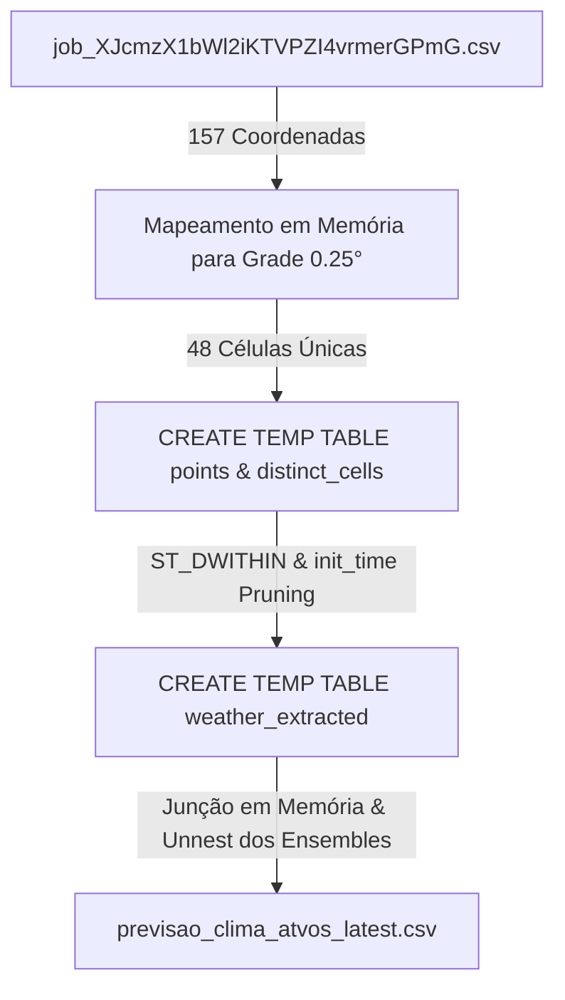

# 🌦️ Previsão de Clima - WeatherNext 2 & Atvos

Pipeline em Python e BigQuery para extração, processamento geoespacial e geração de previsões meteorológicas probabilísticas de alta resolução (Google DeepMind WeatherNext 2) para pontos de interesse geográficos (coordenadas operacionais da Atvos).

---

## 📌 Visão Geral

Este projeto realiza a ingestão de coordenadas geográficas (como unidades, polos agrícolas e talhões) e extrai previsões meteorológicas numéricas completas diretamente do **WeatherNext 2**, modelo meteorológico global de inteligência artificial de alta precisão disponibilizado via **Google Cloud BigQuery**.

A solução processa dados probabilísticos (**64 membros de ensemble**) ao longo de um horizonte de **15 dias (360 horas)** com intervalos de 6 horas, aplicando conversões automáticas para unidades operacionais práticas (°C, mm, m/s).

---

## 🏗️ Arquitetura e Otimização Geoespacial

A tabela fonte do WeatherNext 2 (`weathernext_2_0_0`) armazena bilhões de registros globais particionados por dia (`init_time`) e clusterizados por `geography` (resolução em grade de 0.25° × 0.25°).

Para evitar varreduras massivas desnecessárias (que consumiriam cotas diárias de BigQuery e gerariam custos elevados), o script emprega uma estratégia de execução otimizada:



1. **Descoberta Automática de Rodada (`init_time`):** Identifica a rodada de inicialização mais recente do modelo (`MAX(init_time)`).
2. **Resolução de Células de Grade (0.25°):** Mapeia cada latitude/longitude para o centro da sua respectiva célula da grade meteorológica ($\text{round}(\text{coord} \times 4) / 4$).
3. **Poda de Partição e Cluster com Script Multi-Statement:**
   - Cria tabelas temporárias (`CREATE TEMP TABLE points` e `distinct_cells`) no dataset de sessão do BigQuery.
   - Utiliza `ST_DWITHIN(w.geography, ST_GEOGPOINT(dc.grid_lon, dc.grid_lat), 500)` para disparar a poda por cluster geoespacial no BigQuery.
   - Reduz a leitura de dezenas de gigabytes para apenas ~93 MB, executando em poucos segundos sem estourar limites de cota.
4. **Desaninhamento Completo (Unnest):** Extrai linha a linha todos os membros do ensemble para cada passo temporal e coordenada.

---

## 📊 Especificação das Variáveis

| Variável Original | Campo de Saída | Unidade Original | Unidade Convertida | Transformação Aplicada |
| :--- | :--- | :--- | :--- | :--- |
| `2m_temperature` | `temperature_c` | Kelvin ($K$) | Grau Celsius ($°C$) | $\text{ROUND}(T - 273.15, 2)$ |
| `total_precipitation_6hr` | `precipitation_6hr_mm` | Metros ($m$) | Milímetros ($mm$) | $\text{GREATEST}(0.0, \text{ROUND}(P \times 1000, 3))$ |
| `10m_u_component_of_wind`<br>`10m_v_component_of_wind` | `wind_speed_10m_ms` | $m/s$ | $m/s$ | $\text{ROUND}(\sqrt{u^2 + v^2}, 2)$ |
| `mean_sea_level_pressure` | `sea_level_pressure_pa` | Pascal ($Pa$) | Pascal ($Pa$) | $\text{ROUND}(P_{msl}, 1)$ |

---

## 📁 Estrutura de Arquivos

```text
├── README.md                              # Documentação do projeto
├── .gitignore                             # Regras de exclusão do Git
├── extract_weather_forecast.py            # Script principal de extração do BigQuery e atualização
├── build_dashboard.py                     # Gerador do dashboard HTML interativo
├── dashboard.html                         # Dashboard interativo autossuficiente (mapa + gráficos)
├── job_XJcmzX1bWl2iKTVPZI4vrmerGPmG.csv   # Arquivo de entrada com as coordenadas
├── amostra_previsao.csv                   # Amostra das primeiras 100 linhas da previsão
└── previsao_clima_atvos_latest.csv        # Previsão completa gerada (CSV ~70 MB)
```

---

## 📥 Dados de Entrada

O arquivo de entrada (`job_XJcmzX1bWl2iKTVPZI4vrmerGPmG.csv`) contém os metadados e localização das coordenadas:

| Coluna | Descrição | Exemplo |
| :--- | :--- | :--- |
| `picId` | Identificador do ponto | `26108` |
| `clientId` | Identificador do cliente | `2314` |
| `name` | Identificador da unidade/talhão | `UCP_120002` |
| `unidade` | Sigla da unidade operacional | `UCP` |
| `lat` | Latitude em graus decimais | `-22.414486` |
| `lon` | Longitude em graus decimais | `-52.173444` |
| `quantidade_linhas_unidade` | Total de pontos por unidade | `28` |

---

## 📤 Dados de Saída

O arquivo gerado (`previsao_clima_atvos_latest.csv`) contém a granularidade completa (Ponto × Horário de Previsão × Membro de Ensemble):

| Coluna | Descrição | Exemplo |
| :--- | :--- | :--- |
| `picId` | ID do ponto | `25665` |
| `clientId` | ID do cliente | `2314` |
| `name` | Nome do local | `UAE_440010` |
| `unidade` | Unidade operacional | `UAE` |
| `quantidade_linhas_unidade` | Contagem de linhas | `13` |
| `lat` | Latitude do ponto | `-17.66004` |
| `lon` | Longitude do ponto | `-52.3381` |
| `init_time` | Data/hora de inicialização do modelo | `2026-09-17 06:00:00` |
| `forecast_horizon_hours` | Horizonte à frente em horas (6h a 360h) | `6` |
| `forecast_timestamp` | Timestamp previsto para o evento | `2026-09-17 12:00:00` |
| `ensemble_member` | Identificador do membro do ensemble (0 a 63) | `0` |
| `temperature_c` | Temperatura a 2 metros em °C | `23.5` |
| `precipitation_6hr_mm` | Chuva acumulada em 6 horas em mm | `0.003` |
| `wind_speed_10m_ms` | Velocidade do vento a 10m em m/s | `1.68` |
| `sea_level_pressure_pa` | Pressão ao nível do mar em Pa | `102034.4` |

*Tamanho típico de saída para 157 pontos:* ~602.880 linhas (~70 MB).

---

## 🚀 Pré-requisitos e Execução

### 1. Pré-requisitos

* **Python 3.8+** instalado.
* **Google Cloud SDK (`gcloud` e `bq`)** configurados e autenticados com acesso ao projeto BigQuery:
  ```bash
  gcloud auth login
  gcloud auth application-default login
  gcloud config set project demonstracoes-fabio
  ```

### 2. Execução e Atualização do Dashboard

Para rodar a extração da previsão mais recente e gerar o dashboard:

```bash
python3 extract_weather_forecast.py
```

O script realizará automaticamente:
1. Leitura das coordenadas de entrada.
2. Identificação dinâmica do último `init_time` disponível no BigQuery.
3. Execução da consulta geoespacial otimizada por cluster.
4. Gravação do arquivo `previsao_clima_atvos_latest.csv`.
5. **Geração automática do `dashboard.html`** atualizado com todos os dados.

Caso queira apenas recompilar o dashboard a partir de um CSV já existente:
```bash
python3 build_dashboard.py
```

---

## 🖥️ Dashboard Interativo (`dashboard.html`)

O arquivo `dashboard.html` é **100% autossuficiente** e pode ser aberto diretamente em qualquer navegador (sem necessidade de servidor web ativo):

* **Mapa Geoespacial Interativo (Google Maps JavaScript API):**
  * Visualização de todos os 157 pontos distribuídos pelas 8 unidades operacionais da Atvos.
  * **Modo Satélite Híbrido (`HYBRID`):** Permite inspecionar a vegetação, talhões e lavouras reais sob as coordenadas, além de nomes de rodovias e cidades.
  * Controles nativos do Google Maps (alternador Satélite/Mapa/Relevo, Zoom e Tela Cheia).
  * Marcadores circulares coloridos por Unidade e popups interativos com dados climáticos resumidos.
  * Botão **"Chave Maps"** no cabeçalho para configuração e persistência da API Key via navegador (`localStorage`).
* **Meteograma Probabilístico (Plotly):**
  * **Chuva Acumulada e Taxa 6h:** Gráfico de linha do acumulado com barras de taxa horária.
  * **Ciclo Térmico a 2m:** Curvas diurnas de temperatura ao longo de 15 dias.
  * **Vento a 10m:** Trajetórias de velocidade média e rajadas máximas.
  * **Alternador de Modos:**
    * *Média & Incerteza (P10-P90):* Visualização executiva consolidada.
    * *Spaghetti Plot (64 Membros):* Plota simultaneamente todas as 64 trajetórias individuais de cada membro de previsão.
* **Cards de KPIs & Filtros:**
  * Filtro por Unidade Agroindustrial e seleção rápida de talhão.
  * Total de chuva previsto, ranking de polos mais chuvosos e extremos térmicos.

---

## 🔄 Automação e Orquestração

O pipeline foi projetado para fácil integração em rotinas agendadas (ex: cron jobs, Google Cloud Composer / Apache Airflow, ou Cloud Run Jobs) executadas diariamente após a atualização dos modelos meteorológicos.

